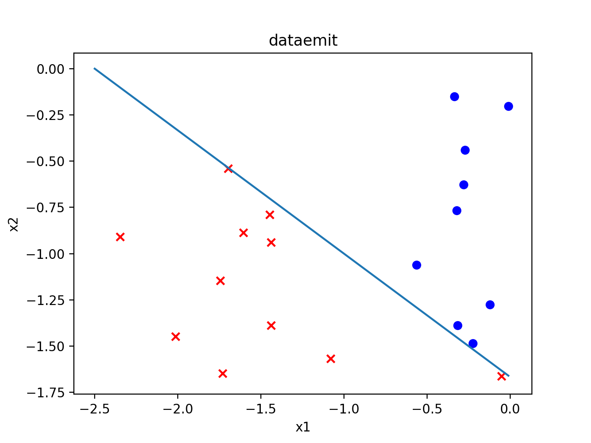
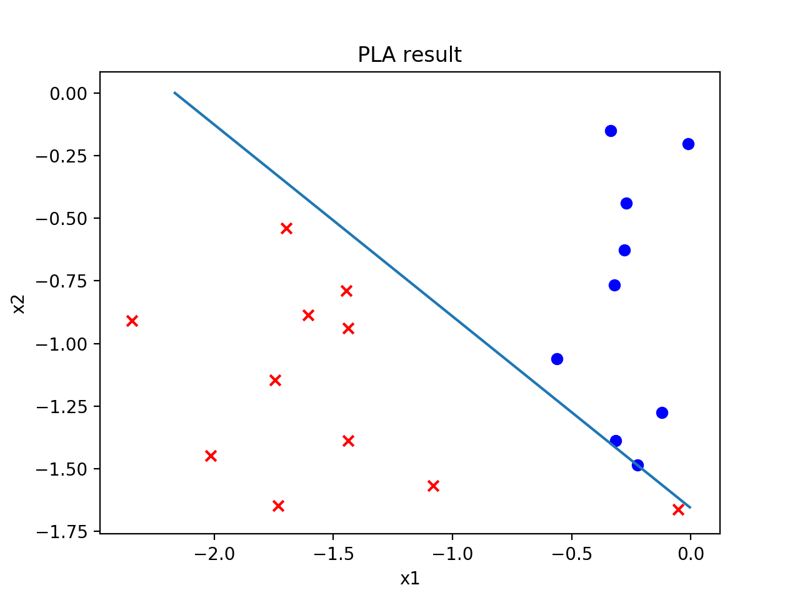
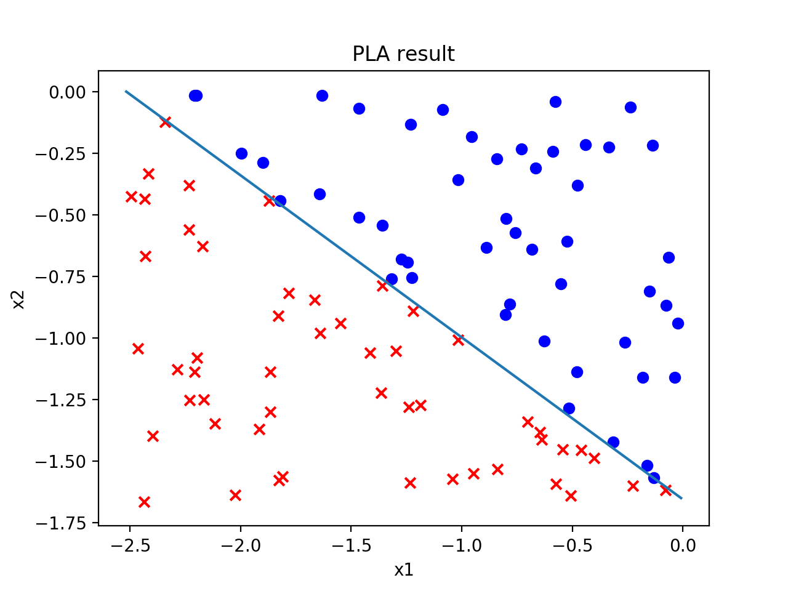
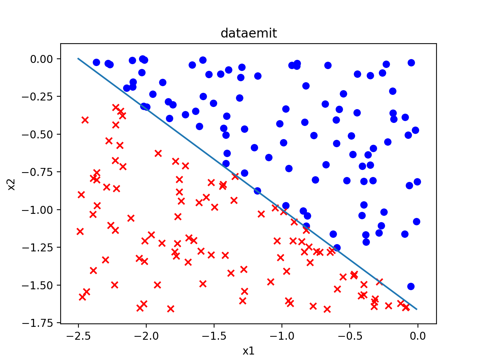
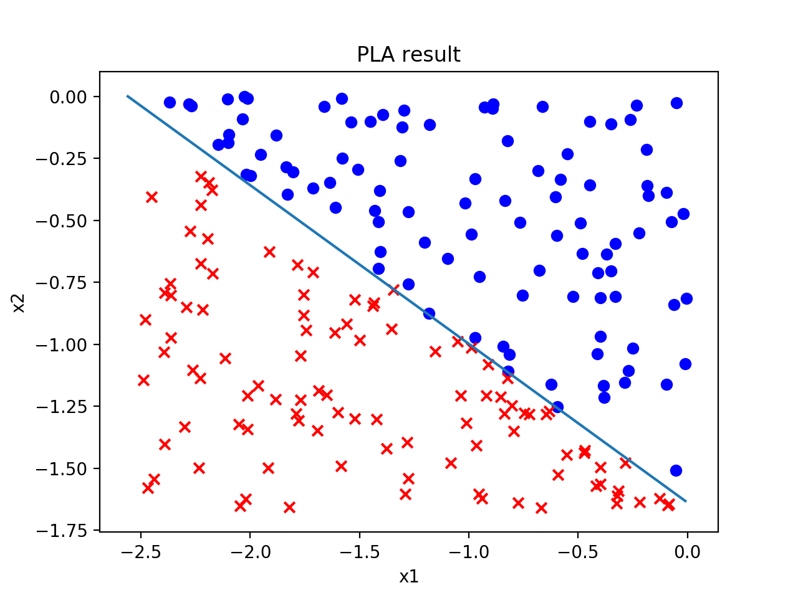
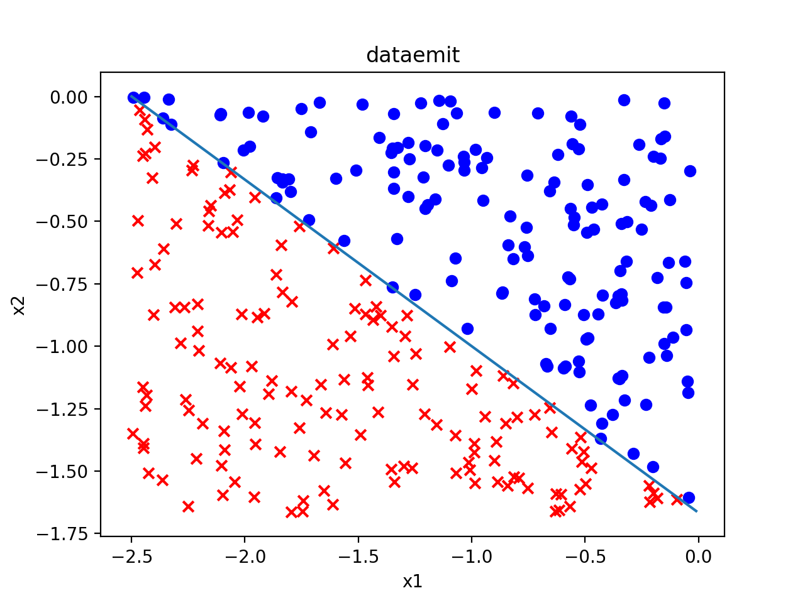
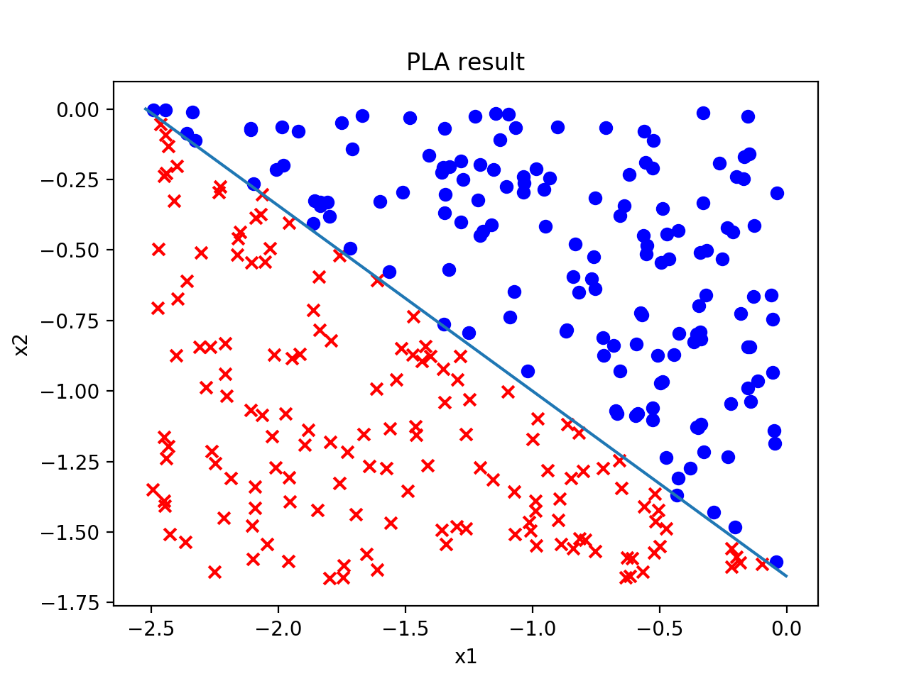
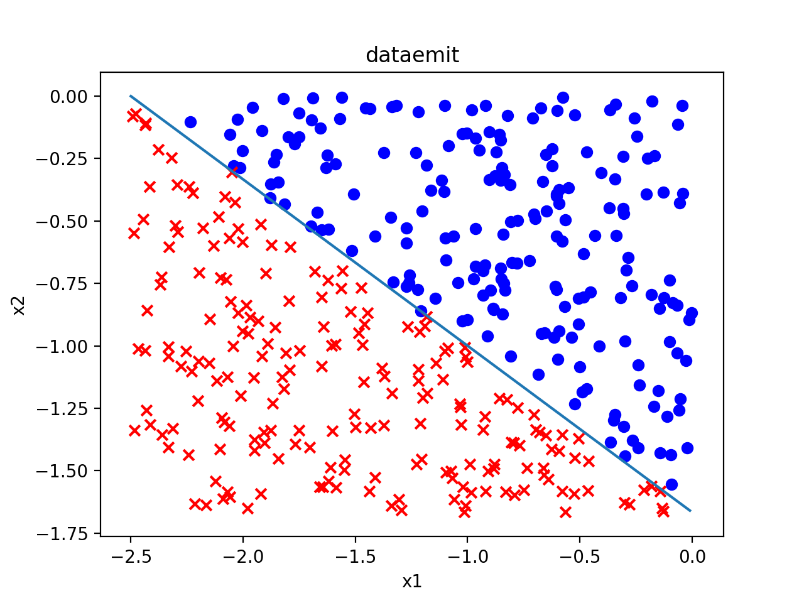

# experiment report

## **given experiments**

### ***training result***:

1. DataEmit [5,2,3] 10 10   

> weight: <4.653211307837301,2.149618366856361,2.8073294800277653>  

<figure class="half">
    
    
</figure>

2. DataEmit [5,2,3] 50 50  
  
> weight: <25.358509234967887,10.072120539163073,15.328932577254589>

<figure class="half">
    
    
</figure>

3. DataEmit [5,2,3] 100 100   
> weight: <42.42352957909652,16.575490424585375,25.892839740445616>

<figure class="half">
    
    
</figure>

4. DataEmit [5,2,3] 150 150    
> weight: <23.303225158770395,9.240600808226029,14.06303494428334>

<figure class="half">
    
    
</figure>

5. DataEmit [5,2,3] 200 200
> weight: <29.831461476290542,11.973959381399991,17.797151731114187>

<figure class="half">
    
    
</figure>

### ***Analyze***  

*weight compare*:

W|m/n|PLAresult: W_rate (diff)|totaldiff
:-:|:-:|:-:|:-:
5:2:3|10|5 : 2.31 (0.31) : 3.02(0.02)|0.33
5:2:3|50|5 : 1.99 (0.01) : 3.02(0.02)|0.03
5:2:3|100|5 : 1.95 (0.05) : 3.05(0.05)|0.10
5:2:3|150|5 : 1.98 (0.02) : 3.02(0.02)|0.04
5:2:3|200|5 : 2.01 (0.01) : 2.98(0.02)|0.03

  With the size of data increasing, the output of the PLA will closer to the "line"

## **own experiments**
### ***Analyze***:  

*weight compare*:

label|W|m|n|m+n|PLAresult: W_rate (diff)|totaldiff
:-:|:-:|:-:|:-:|:-:|:-:|:-:
1|3:2:7|10|10|20|3 : 1.91 (0.09) : 6.43 (0.57)|0.66
2|3:2:7|50|50|100|3 : 2.00 (0.00) : 6.90 (0.10)|0.10
3|3:2:7|100|100|200|3 : 2.00 (0.00) : 6.97 (0.03)|0.03
4|3:2:7|200|200|400|3 : 2.00 (0.00) : 7.06 (0.06)|0.06
5|3:2:7|90|110|200|3 : 2.01 (0.01) : 7.00 (0.00)|0.01
6|3:2:7|70|130|200|3 : 2.01 (0.01) : 7.02 (0.02)|0.03
7|3:2:7|50|150|200|3 : 2.00 (0.00) : 7.02 (0.02)|0.02

1. With the size of data increasing, the output of the PLA will closer to the "line"(from label 1,2,3,4)
2. When m+n is big enough the balance has little effect to the output of PLA (from label 5,6,7)
